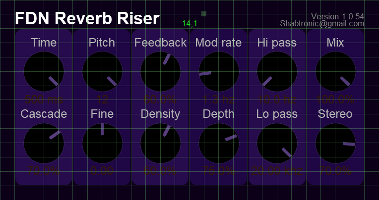

# ReaperJSLib
Handy lib for reaper JS plugins - UI and General DSP code

Hold ctrl and Left mouse click to toggle UI grid!

@slider callbacks no longer work with this system so you can use
@block and lazy state change to get updates from the sliders.

Example how to use this lib is here: 

https://github.com/shabtronic/FDN-Reverb-Riser/blob/master/FDN%20Verb%20Riser

